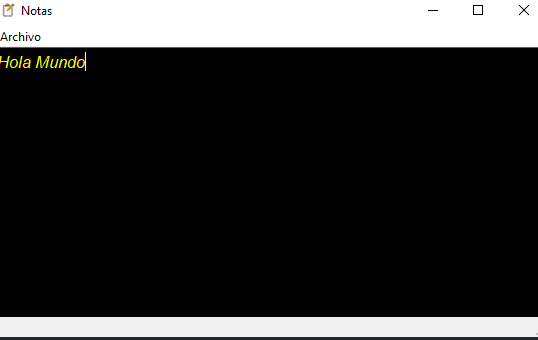
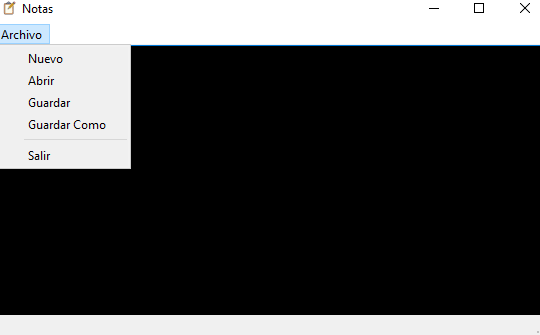

# Editor de Texto
## Herramientas
*   Python
*   Qtdisainer
*   Pyside2

#

## Descripcion y Uso
Esta app de escritorio es un editor de texto, cuenta con una pestaña donde se despliengas las opciones de abrir, guardar, guardar como y cerrar.
tiene un estilo, en el que el fondo es negro y el texto es de color amarillo, funciona de manera como un editor cualquiera seleccionando las opciones de la pestaña desplegable.

#

## Detalles de codigo
Los archivos notas.ui y ui_notas.py el primero es un archivo generado de codigo de la interfaz de qtdisainer y el segundo es el archivo de python del primero mencionadio, para su posterior manipulacion de los widgets, core es el archivo para correr el programa y el archivo notas contiene el codigo logico del programa.
Con con la libreria pyside2 manipulo los widgets,
todas las librerias si no las tienes instaladas solo puedes usar pip install nombredelibreria y es todo.

## Imagenes de Muestra

#

